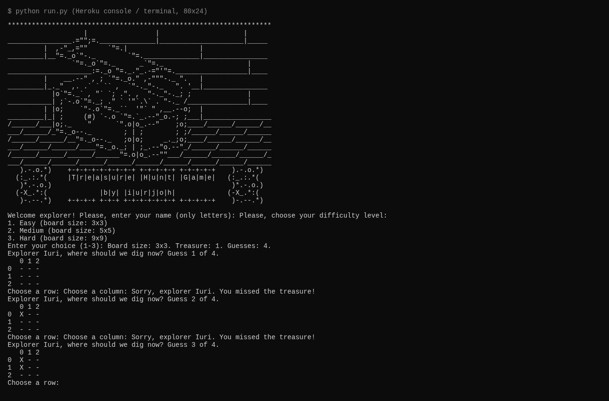
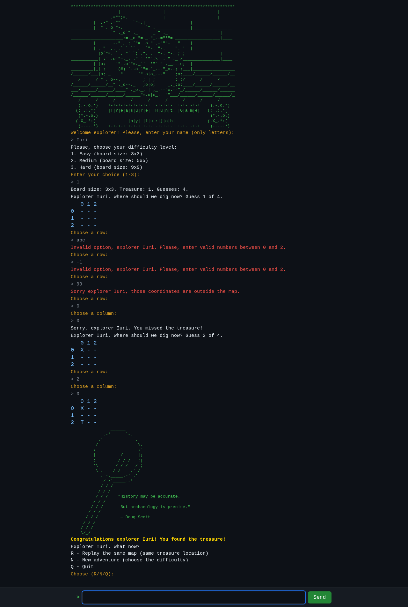
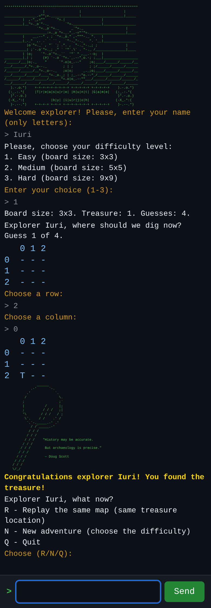

# Treasure Hunt

[Português (Brasil)](README.pt-BR.md) | **English**

A Python terminal game, now running **in the browser** - no install, no
backend, works on phone and desktop. The page loads Python itself
([Pyodide](https://pyodide.org), WebAssembly) and plays the exact same
game engine as the terminal version.

> **Status (2026-10-01):** revival branch, web port complete and tested.
> The game is live at https://treasure-hunt-due.pages.dev/web/ on
> Cloudflare Pages (free tier); the page was opened and confirmed
> reachable on 2026-10-01.

## Play

### In the browser

Serve the repository root with any static file server and open
`web/index.html` - or just visit the live site:

```bash
python3 -m http.server 8000
# then open http://localhost:8000/web/
```

The first load downloads the Python runtime from the Pyodide CDN
(a few MB, cached by the browser afterwards). Everything runs locally
in your browser tab; nothing is sent anywhere.

### In the terminal

```bash
python3 run.py
```

Requires Python 3.8+. No dependencies.

## The game

You are an explorer hunting a treasure chest hidden on a grid:

- Choose a difficulty: Easy (3x3), Medium (5x5) or Hard (9x9).
- You get `int(size * 1.5)` guesses: 4, 7 or 13 digs.
- Each dig marks the map (`X`). Find the chest (`T`) before you run
  out of guesses.
- When a match ends you can **replay the same map** (same treasure
  location), start a **new adventure** (new difficulty, new treasure)
  or quit.

## Screenshots

| | Before (terminal only) | After (web port) |
|---|---|---|
| Desktop |  |  |
| Mobile | no mobile version existed |  |

More: [gameplay](assets/images/revival/web-desktop-start.png),
[defeat](assets/images/revival/web-desktop-loss.png),
[replay same map](assets/images/revival/web-desktop-replay.png),
[mobile start](assets/images/revival/web-mobile-start.png),
[mobile defeat](assets/images/revival/web-mobile-loss.png).

## Revival: what changed (audit of 2026-09-30)

| Severity | Issue | Fix |
|---|---|---|
| P0 | `UnicodeDecodeError`/crash printing the art on cp1252 terminals (Windows) | `run.py` reconfigures stdout/stderr to UTF-8 with `errors="replace"`; the web version renders in the DOM, which is UTF-8 by nature |
| P0 | "Restart" silently started a **new** match instead of replaying the same one | Post-match menu now offers `R` = replay the same map (same board size and treasure location), `N` = new adventure, `Q` = quit |
| P0 | `EOF` (Ctrl+D) closed the game with an ugly traceback | `EOFError`/`KeyboardInterrupt` are caught and end the game with a clean farewell, exit code 0 |
| P2 | Unprotected `while True` wrappers, double restart prompt after each match | Game flow is now an explicit state machine (`name → level → row/col → menu → done`) shared by CLI and web |
| - | No automated tests in the repo | Full suite added (see below) |
| - | Heroku/Node/Gitpod template leftovers (`Procfile`, `index.js`, `package.json`, `views/`, `controllers/`) | Removed; the project is pure Python + static web now |

### Architecture

The game logic lives in `treasure_hunt.py`, a pure state machine with
no `input()`/`print()` inside. Three drivers share it:

- `run.py` - the terminal CLI.
- `web/` - the browser front-end (Pyodide loads the same
  `treasure_hunt.py` file and calls `start()`/`submit()`).
- `tests/` - the automated suite.

One engine, three drivers: the terminal, the browser and the tests can
never drift apart.

## Testing

```bash
pip install -r requirements-dev.txt
python3 -m pytest tests/ -q
```

Suite (70 tests):

- **30 scripted wins** across all board sizes, names and chest spots.
- **30 scripted losses** that burn every guess and verify the defeat
  flow and the revealed treasure location.
- **600 fuzzed rounds** across 9 input classes (valid, non-digit,
  empty, negative, out-of-range, repeated coordinate, whitespace, huge
  numbers, unicode) asserting the engine never crashes, never loses
  state and never lets garbage consume a guess.
- **Restart semantics**: replaying the same map keeps the same
  treasure; a new adventure asks for difficulty; quit exits cleanly.
- **CLI subprocess tests**: EOF at the first prompt and mid-game exits
  0 with no traceback; a full seeded win (`TREASURE_HUNT_SEED`) through
  the real `run.py`.
- **Browser end-to-end** (run manually with Playwright against a local
  static server): win, defeat, replay-same-map, quit and invalid input
  on desktop (1280x800) and mobile (390x844) viewports, checking for
  horizontal overflow.

### Deterministic hooks

- CLI: `TREASURE_HUNT_SEED=42 python3 run.py`
- Web: open `web/index.html?seed=42`

Both place the treasure deterministically - used by the test suite.

## Deployment (Cloudflare Pages, free)

The site is fully static, so the free tier is enough - no card, no
billing:

1. Cloudflare dashboard → **Workers & Pages** → **Create** → **Pages**
   → **Connect to Git** (or **Direct Upload** of this folder).
2. Build settings: **no build command**, output directory = the
   repository root.
3. Deploy. The game lives at `https://<project>.pages.dev/`
   (the root `index.html` redirects to `web/`).

GitHub Pages works the same way (serve the repo root).

## Project structure

```
treasure_hunt.py   game engine (state machine, no I/O)
run.py             terminal entry point (UTF-8 safe, EOF safe)
web/index.html     browser UI
web/app.js         Pyodide loader + renderer
web/style.css      responsive terminal look (mobile + desktop)
index.html         redirect to web/
tests/             pytest suite (70 tests)
assets/images/     screenshots (revival/ holds the web-port ones)
```

## Credits

- Original project: Code Institute Portfolio Project 3 (Python CLI),
  by [iurjoh](https://github.com/iurjoh).
- Quotes in the end-game art: Doug Scott and Albert Einstein.
- Browser runtime: [Pyodide](https://pyodide.org) (CPython compiled to
  WebAssembly), loaded from the jsDelivr CDN.

## Measured quality (live site, 2026-09-30, commit d855188)

Measured against https://treasure-hunt-due.pages.dev/web/ with
Lighthouse 12 (headless Chromium), axe-core 4.10 and the W3C validators.
Each Lighthouse row is the median of 3 runs.

| Check | Result | Target |
| --- | --- | --- |
| Lighthouse mobile, cold cache | Perf 100, A11y 100, Best Practices 100, SEO 100 | Perf >= 90, others 100 |
| Lighthouse desktop, cold cache | Perf 100, A11y 100, Best Practices 100, SEO 100 | same |
| Lighthouse mobile + desktop, warm cache | 100 / 100 / 100 / 100 | Perf >= 95 |
| axe-core (wcag2a/2aa/21a/21aa/22aa) on 4 game states | 0 violations, 0 incomplete | 0 violations |
| W3C Nu HTML (`/web/`, root redirect) | 0 errors | 0 errors |
| W3C CSS (`web/style.css`) | 0 errors (1 deprecation note on `word-break: break-word`, kept for compatibility) | 0 errors |
| Keyboard-only play (Tab/Enter, no mouse) | full win path works; input auto-focused, visible focus ring | must work |
| Reflow at 320px and zoom 200%/400% | no horizontal overflow | no overflow |
| Cold time-to-playable (Pyodide boot, measured) | ~2.5-2.8 s on cable; static terminal UI paints immediately | - |
